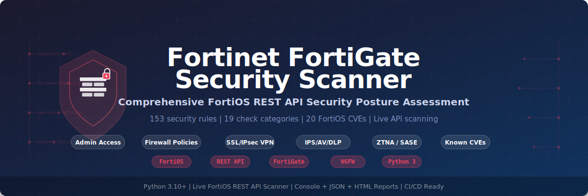

<p align="center">
  
</p>

<h1 align="center">Fortinet FortiGate Security Scanner</h1>

<p align="center">
  <strong>Comprehensive FortiOS REST API Security Posture Assessment</strong>
</p>

<p align="center">
  
  
  
  
  
  
</p>

---

## Table of Contents

- [Overview](#overview)
- [Features](#features)
- [Supported Targets](#supported-targets)
- [Architecture](#architecture)
- [Prerequisites](#prerequisites)
- [Installation](#installation)
- [API Token Setup](#api-token-setup)
- [Usage](#usage)
  - [Basic Scan](#basic-scan)
  - [Filtered Scan](#filtered-scan)
  - [Report Generation](#report-generation)
  - [Environment Variables](#environment-variables)
- [Check Categories](#check-categories)
  - [1. Admin Access (FORTIOS-ADMIN)](#1-admin-access-fortios-admin)
  - [2. Firewall Policies (FORTIOS-POLICY)](#2-firewall-policies-fortios-policy)
  - [3. SSL VPN (FORTIOS-SSLVPN)](#3-ssl-vpn-fortios-sslvpn)
  - [4. IPsec VPN (FORTIOS-IPSEC)](#4-ipsec-vpn-fortios-ipsec)
  - [5. Security Profiles (FORTIOS-PROFILE)](#5-security-profiles-fortios-profile)
  - [6. Logging & Monitoring (FORTIOS-LOG)](#6-logging--monitoring-fortios-log)
  - [7. High Availability (FORTIOS-HA)](#7-high-availability-fortios-ha)
  - [8. Certificates (FORTIOS-CERT)](#8-certificates-fortios-cert)
  - [9. Network Hardening (FORTIOS-NET)](#9-network-hardening-fortios-net)
  - [10. FortiGuard Updates (FORTIOS-UPDATE)](#10-fortiguard-updates-fortios-update)
  - [11. ZTNA / SASE (FORTIOS-ZTNA)](#11-ztna--sase-fortios-ztna)
  - [12. Known CVEs (FORTIOS-CVE)](#12-known-cves-fortios-cve)
- [API Endpoints](#api-endpoints)
- [Output Formats](#output-formats)
  - [Terminal Output](#terminal-output)
  - [JSON Report](#json-report)
  - [HTML Report](#html-report)
- [Exit Codes](#exit-codes)
- [CLI Reference](#cli-reference)
- [Examples](#examples)
- [CI/CD Integration](#cicd-integration)
- [Security Considerations](#security-considerations)
- [License](#license)

---

## Overview

The **Fortinet FortiGate Security Scanner** is a Python-based live-API security assessment tool that connects to FortiGate Next-Generation Firewall (NGFW) appliances via the FortiOS REST API and evaluates their security posture against industry best practices and known vulnerabilities.

It performs **153 security checks** across **12 categories**, including firewall policy hygiene, admin access hardening, VPN configuration, security profile enforcement, logging, high availability, certificate management, ZTNA readiness, and **20 known FortiOS CVEs** with automatic firmware version matching.

### Key Capabilities

- **Live API scanning** — Connects directly to FortiGate appliances via REST API
- **Zero-agent deployment** — No software installation on the target device
- **CVE detection** — Automatic firmware version matching against 20 known FortiOS vulnerabilities
- **Multi-format reports** — Console (colour-coded), JSON, and interactive HTML
- **CI/CD ready** — Exit code 1 on CRITICAL/HIGH findings for pipeline integration
- **Severity filtering** — Focus on findings that matter most

---

## Features

| Feature | Description |
|---------|-------------|
| **19 Check Categories** | Admin access, system settings, firewall policies, SSL VPN, IPsec VPN, security profiles (AV, IPS, WebFilter, AppControl, DLP, DNS, SSL inspection), logging, HA, certificates, network hardening (DoS, SNMP, routing, NTP), FortiGuard, ZTNA/SD-WAN, CVEs |
| **20 Known CVEs** | CVE-2024-55591, CVE-2024-21762, CVE-2023-27997, CVE-2022-42475, and more |
| **Train-Based CVE Matching** | Automatically matches firmware version against affected version ranges per release train |
| **Dark Theme HTML Reports** | Interactive reports with severity filtering, expandable details, and search |
| **Self-Signed Cert Support** | SSL verification disabled by default for appliance self-signed certificates |
| **Single File** | Entire scanner in one self-contained Python file — no complex setup |

---

## Supported Targets

| Platform | FortiOS Version | Connection |
|----------|----------------|------------|
| FortiGate NGFW (hardware) | 6.x, 7.x | REST API (HTTPS) |
| FortiGate-VM (cloud/on-prem) | 6.x, 7.x | REST API (HTTPS) |
| FortiWiFi appliances | 6.x, 7.x | REST API (HTTPS) |

---

## Architecture

```
┌─────────────────────────────────────────────────┐
│                fortinet_scanner.py               │
├─────────────────────────────────────────────────┤
│  FORTIOS_CVES[]        20 CVE definitions       │
│  Finding               __slots__-based class     │
│  _ReportMixin          print_report, save_json,  │
│                        save_html, summary,       │
│                        filter_severity           │
│  FortinetScanner       13 _check_* methods       │
│  main()                CLI entry point           │
└─────────────────────────────────────────────────┘
         │                           │
         ▼                           ▼
   FortiOS REST API           Report Output
   /api/v2/cmdb/...          Console | JSON | HTML
   /api/v2/monitor/...
```

### Scanner Flow

1. **Connect** — Authenticate to FortiGate via API token
2. **Discover** — Retrieve system info and firmware version from `/api/v2/monitor/system/status`
3. **Collect** — Pull configuration from `/api/v2/cmdb/` endpoints
4. **Analyse** — Run 13 check methods across 12 categories
5. **CVE Match** — Compare firmware version against 20 known CVE version ranges
6. **Report** — Output findings to console, JSON, and/or HTML

---

## Prerequisites

- **Python 3.10+**
- **requests** library
- **FortiGate** with REST API enabled
- **API token** with read access to system configuration

---

## Installation

```bash
# Clone the repository
git clone https://github.com/Krishcalin/Fortinet-Network-Security.git
cd Fortinet-Network-Security

# Install dependencies
pip install requests
```

---

## API Token Setup

Generate a REST API token on the FortiGate:

1. Navigate to **System > Administrators**
2. Click **Create New > REST API Admin**
3. Set a username (e.g., `scanner-api`)
4. Assign an **admin profile** with **read-only** access
5. Optionally restrict **Trusted Hosts** to the scanner's IP
6. Click **OK** and copy the generated API token

> **Important**: Store the API token securely. It provides read access to the FortiGate configuration.

---

## Usage

### Basic Scan

```bash
python fortinet_scanner.py 10.1.1.1 --token <API-TOKEN>
```

### Filtered Scan

```bash
# Only show HIGH and CRITICAL findings
python fortinet_scanner.py fw.corp.local --token <TOKEN> --severity HIGH
```

### Report Generation

```bash
# Generate JSON and HTML reports
python fortinet_scanner.py 10.1.1.1 --token <TOKEN> --json report.json --html report.html

# Verbose output with all details
python fortinet_scanner.py 10.1.1.1 --token <TOKEN> --verbose
```

### Environment Variables

| Variable | Description |
|----------|-------------|
| `FORTIOS_API_TOKEN` | FortiOS REST API token (alternative to `--token`) |

```bash
export FORTIOS_API_TOKEN="your-api-token-here"
python fortinet_scanner.py 10.1.1.1
```

---

## Check Categories

### 1. Admin Access (FORTIOS-ADMIN)

**12 rules** — Audits administrator account security and management access configuration.

| Rule ID | Severity | Description |
|---------|----------|-------------|
| FORTIOS-ADMIN-001 | CRITICAL | HTTP admin access enabled on interface |
| FORTIOS-ADMIN-002 | HIGH | Admin idle timeout exceeds 300 seconds |
| FORTIOS-ADMIN-003 | HIGH | Weak admin password policy (min length < 8) |
| FORTIOS-ADMIN-004 | HIGH | No trusted hosts configured for admin |
| FORTIOS-ADMIN-005 | CRITICAL | Default "admin" account still active |
| FORTIOS-ADMIN-006 | HIGH | API user without trusted hosts |
| FORTIOS-ADMIN-007 | MEDIUM | API token without expiry date |
| FORTIOS-ADMIN-008 | HIGH | Multiple super_admin profiles |
| FORTIOS-ADMIN-009 | MEDIUM | PING enabled on WAN interface |
| FORTIOS-ADMIN-010 | HIGH | Telnet admin enabled on interface |
| FORTIOS-ADMIN-011 | HIGH | No two-factor authentication for admin |
| FORTIOS-ADMIN-012 | MEDIUM | Admin account using default profile |

### 2. Firewall Policies (FORTIOS-POLICY)

**12 rules** — Evaluates firewall policy hygiene, segmentation, and security posture.

| Rule ID | Severity | Description |
|---------|----------|-------------|
| FORTIOS-POLICY-001 | LOW | Disabled firewall policy (hygiene) |
| FORTIOS-POLICY-002 | CRITICAL | Any-to-any allow rule detected |
| FORTIOS-POLICY-003 | HIGH | Allow policy with 'all' source |
| FORTIOS-POLICY-004 | HIGH | Allow policy with ALL services (overly broad) |
| FORTIOS-POLICY-005 | HIGH | Allow policy without logging |
| FORTIOS-POLICY-006 | CRITICAL | Allow policy without UTM/security profiles |
| FORTIOS-POLICY-007 | LOW | Unnamed firewall policy |
| FORTIOS-POLICY-008 | MEDIUM | Deny policy without logging |
| FORTIOS-POLICY-009 | HIGH | Allow policy with 'all' destination |
| FORTIOS-POLICY-010 | MEDIUM | Allow policy without SSL inspection |
| FORTIOS-POLICY-011 | MEDIUM | Broad allow policy with permanent schedule |
| FORTIOS-POLICY-012 | LOW | High ratio of disabled policies |

### 3. SSL VPN (FORTIOS-SSLVPN)

**5 rules** — Checks SSL VPN configuration for security weaknesses.

| Rule ID | Severity | Description |
|---------|----------|-------------|
| FORTIOS-SSLVPN-001 | CRITICAL | SSL VPN using weak TLS version (< 1.2) |
| FORTIOS-SSLVPN-002 | HIGH | Split tunnelling enabled |
| FORTIOS-SSLVPN-003 | MEDIUM | SSL VPN on default port |
| FORTIOS-SSLVPN-004 | HIGH | No client certificate authentication |
| FORTIOS-SSLVPN-005 | HIGH | Idle timeout exceeds 300 seconds |

### 4. IPsec VPN (FORTIOS-IPSEC)

**6 rules** — Audits IPsec VPN Phase 1 and Phase 2 proposals.

| Rule ID | Severity | Description |
|---------|----------|-------------|
| FORTIOS-IPSEC-001 | CRITICAL | Weak Phase 1 encryption (DES/3DES) |
| FORTIOS-IPSEC-002 | CRITICAL | Weak Phase 1 hash (MD5) |
| FORTIOS-IPSEC-003 | HIGH | Weak Diffie-Hellman group (DH1/DH2/DH5) |
| FORTIOS-IPSEC-004 | HIGH | IKEv1 aggressive mode (identity exposure) |
| FORTIOS-IPSEC-005 | CRITICAL | Weak Phase 2 encryption (DES/3DES) |
| FORTIOS-IPSEC-006 | HIGH | No Perfect Forward Secrecy (PFS) |

### 5. Security Profiles (FORTIOS-PROFILE)

**6 rules** — Validates that essential security profiles are configured and active.

| Rule ID | Severity | Description |
|---------|----------|-------------|
| FORTIOS-PROFILE-001 | HIGH | No antivirus profiles configured |
| FORTIOS-PROFILE-002 | HIGH | No IPS sensors configured |
| FORTIOS-PROFILE-003 | MEDIUM | No web filter profiles configured |
| FORTIOS-PROFILE-004 | MEDIUM | No application control profiles configured |
| FORTIOS-PROFILE-005 | HIGH | No DLP sensors configured |
| FORTIOS-PROFILE-006 | MEDIUM | SSL inspection in certificate-only mode |

### 6. Logging & Monitoring (FORTIOS-LOG)

**4 rules** — Ensures adequate logging and monitoring configuration.

| Rule ID | Severity | Description |
|---------|----------|-------------|
| FORTIOS-LOG-001 | HIGH | No FortiAnalyzer configured |
| FORTIOS-LOG-002 | HIGH | No syslog server configured |
| FORTIOS-LOG-003 | MEDIUM | Local log disk full action set to overwrite |
| FORTIOS-LOG-004 | MEDIUM | Log encryption not enabled |

### 7. High Availability (FORTIOS-HA)

**4 rules** — Checks HA cluster configuration for resilience.

| Rule ID | Severity | Description |
|---------|----------|-------------|
| FORTIOS-HA-001 | MEDIUM | HA not configured (single point of failure) |
| FORTIOS-HA-002 | HIGH | HA heartbeat encryption disabled |
| FORTIOS-HA-003 | MEDIUM | Session pickup not enabled |
| FORTIOS-HA-004 | MEDIUM | No dedicated HA heartbeat interface |

### 8. Certificates (FORTIOS-CERT)

**3 rules** — Validates certificate security and expiry.

| Rule ID | Severity | Description |
|---------|----------|-------------|
| FORTIOS-CERT-001 | HIGH | Default Fortinet factory certificate in use |
| FORTIOS-CERT-002 | CRITICAL | Certificate expired |
| FORTIOS-CERT-003 | HIGH | Certificate expiring within 30 days |

### 9. Network Hardening (FORTIOS-NET)

**16 rules** — Comprehensive network security: DoS protection, routing authentication, SNMP hardening, NTP, and anti-spoofing.

| Rule ID | Severity | Description |
|---------|----------|-------------|
| FORTIOS-NET-001 | MEDIUM | No DoS policy configured |
| FORTIOS-NET-002 | MEDIUM | DoS SYN flood threshold too high |
| FORTIOS-NET-003 | MEDIUM | DoS UDP flood threshold too high |
| FORTIOS-NET-004 | LOW | DoS ICMP flood threshold too high |
| FORTIOS-NET-005 | HIGH | DHCP relay on WAN interface |
| FORTIOS-NET-006 | LOW | DNS server override disabled on WAN |
| FORTIOS-NET-007 | HIGH | Source IP check (RPF/anti-spoofing) disabled |
| FORTIOS-NET-008 | HIGH | TCP sessions without SYN allowed |
| FORTIOS-NET-009 | MEDIUM | IPv6 enabled but no IPv6 firewall policies |
| FORTIOS-NET-010 | LOW | LLDP reception enabled globally |
| FORTIOS-NET-011 | HIGH | BGP neighbour without MD5 authentication |
| FORTIOS-NET-012 | HIGH | OSPF interface without authentication |
| FORTIOS-NET-013 | CRITICAL | SNMP default community string (public/private) |
| FORTIOS-NET-014 | HIGH | SNMPv1 enabled (cleartext, no auth) |
| FORTIOS-NET-015 | HIGH | SNMPv3 user without authentication |
| FORTIOS-NET-016 | MEDIUM | NTP authentication not enabled |

### 10. FortiGuard Updates (FORTIOS-UPDATE)

**7 rules** — Validates FortiGuard licensing, signature freshness, and update status.

| Rule ID | Severity | Description |
|---------|----------|-------------|
| FORTIOS-UPDATE-001 | HIGH | FortiGuard service expired or disabled |
| FORTIOS-UPDATE-002 | HIGH | FortiGuard not connected |
| FORTIOS-UPDATE-003 | MEDIUM | FortiGuard licence expiring within 30 days |
| FORTIOS-UPDATE-004 | HIGH | AV/IPS signatures outdated (>7 days) |
| FORTIOS-UPDATE-005 | MEDIUM | FortiGuard service not updated (>30 days) |
| FORTIOS-UPDATE-006 | HIGH | Automatic updates disabled |
| FORTIOS-UPDATE-007 | CRITICAL | FortiOS running on end-of-life branch |

### 11. ZTNA / SASE / SD-WAN (FORTIOS-ZTNA)

**5 rules** — Evaluates Zero Trust Network Access readiness and SD-WAN configuration.

| Rule ID | Severity | Description |
|---------|----------|-------------|
| FORTIOS-ZTNA-001 | MEDIUM | ZTNA access proxies not configured |
| FORTIOS-ZTNA-002 | MEDIUM | ZTNA access proxy with no API gateway rules |
| FORTIOS-ZTNA-003 | HIGH | ZTNA proxy without client certificate requirement |
| FORTIOS-ZTNA-004 | HIGH | SD-WAN enabled without health checks |
| FORTIOS-ZTNA-005 | MEDIUM | SD-WAN without service/SLA rules |

### 12. Known CVEs (FORTIOS-CVE)

**20 CVEs** — Automatically matches firmware version against known FortiOS vulnerabilities.

| Rule ID | CVE | Severity | Description |
|---------|-----|----------|-------------|
| FORTIOS-CVE-001 | CVE-2024-55591 | CRITICAL | Auth bypass via Node.js websocket module |
| FORTIOS-CVE-002 | CVE-2024-21762 | CRITICAL | SSL VPN out-of-bounds write (RCE) |
| FORTIOS-CVE-003 | CVE-2024-23113 | CRITICAL | Format string vulnerability in fgfmd |
| FORTIOS-CVE-004 | CVE-2023-27997 | CRITICAL | SSL VPN heap buffer overflow (xortigate) |
| FORTIOS-CVE-005 | CVE-2022-42475 | CRITICAL | SSL VPN heap overflow + backdoor |
| FORTIOS-CVE-006 | CVE-2024-47575 | CRITICAL | FortiJump — FortiManager missing auth |
| FORTIOS-CVE-007 | CVE-2023-48788 | CRITICAL | FortiClient EMS SQL injection |
| FORTIOS-CVE-008 | CVE-2023-36554 | HIGH | FortiManager API RCE |
| FORTIOS-CVE-009 | CVE-2023-50176 | HIGH | Session hijacking via cookie reuse |
| FORTIOS-CVE-010 | CVE-2024-0012 | CRITICAL | Node.js websocket auth bypass |
| FORTIOS-CVE-011 | CVE-2022-40684 | CRITICAL | Auth bypass in admin API |
| FORTIOS-CVE-012 | CVE-2021-44228 | CRITICAL | Log4j (FortiOS Java components) |
| FORTIOS-CVE-013 | CVE-2023-25610 | CRITICAL | Buffer underflow in admin interface |
| FORTIOS-CVE-014 | CVE-2022-41328 | HIGH | Path traversal in firmware upgrade |
| FORTIOS-CVE-015 | CVE-2023-44250 | HIGH | Privilege escalation via HA protocol |
| FORTIOS-CVE-016 | CVE-2023-42789 | CRITICAL | Captive portal buffer overflow |
| FORTIOS-CVE-017 | CVE-2023-42790 | HIGH | Captive portal stack overflow |
| FORTIOS-CVE-018 | CVE-2024-48884 | MEDIUM | Path traversal in HTTPD |
| FORTIOS-CVE-019 | CVE-2024-46666 | MEDIUM | Resource exhaustion in HTTPD |
| FORTIOS-CVE-020 | CVE-2024-46668 | HIGH | Memory exhaustion in IPS |

---

## API Endpoints

The scanner queries the following FortiOS REST API endpoints:

| Category | Endpoint | Purpose |
|----------|----------|---------|
| System | `/api/v2/monitor/system/status` | Firmware version, hostname, serial |
| Admin | `/api/v2/cmdb/system/admin` | Admin accounts and profiles |
| API Users | `/api/v2/cmdb/system/api-user` | REST API user configuration |
| Global Settings | `/api/v2/cmdb/system/global` | System-wide security settings |
| Interfaces | `/api/v2/cmdb/system/interface` | Interface management access |
| Firewall | `/api/v2/cmdb/firewall/policy` | Firewall policy rules |
| SSL VPN | `/api/v2/cmdb/vpn.ssl/settings` | SSL VPN configuration |
| IPsec Phase 1 | `/api/v2/cmdb/vpn.ipsec/phase1-interface` | IKE proposals |
| IPsec Phase 2 | `/api/v2/cmdb/vpn.ipsec/phase2-interface` | ESP proposals |
| Antivirus | `/api/v2/cmdb/antivirus/profile` | AV profile configuration |
| IPS | `/api/v2/cmdb/ips/sensor` | IPS sensor configuration |
| Web Filter | `/api/v2/cmdb/webfilter/profile` | Web filtering profiles |
| App Control | `/api/v2/cmdb/application/list` | Application control lists |
| DLP | `/api/v2/cmdb/dlp/sensor` | Data loss prevention sensors |
| FortiAnalyzer | `/api/v2/cmdb/log.fortianalyzer/setting` | FortiAnalyzer log target |
| Syslog | `/api/v2/cmdb/log.syslogd/setting` | Syslog server configuration |
| HA | `/api/v2/cmdb/system/ha` | High availability settings |
| Certificates | `/api/v2/cmdb/vpn.certificate/local` | Local certificate store |
| ZTNA | `/api/v2/cmdb/firewall/access-proxy` | ZTNA access proxy rules |
| Licensing | `/api/v2/monitor/license/status` | FortiGuard license status |

---

## Output Formats

### Terminal Output

Colour-coded console output with severity indicators:

```
============================================================
  Fortinet FortiGate Security Scanner v1.0.0
============================================================
  Target     : 10.1.1.1
  Firmware   : FortiOS 7.0.14
  Hostname   : FW-EDGE-01
  Serial     : FGT60F1234567890
============================================================

[CRITICAL] FORTIOS-CVE-001 — Authentication bypass via Node.js websocket module
  CVE       : CVE-2024-55591
  CWE       : CWE-288
  Details   : An authentication bypass using an alternate path...
  Fix       : Upgrade to FortiOS 7.0.17 or later...

[HIGH] FORTIOS-ADMIN-002 — Admin idle timeout exceeds 300 seconds
  CWE       : CWE-613
  Details   : Admin idle timeout is set to 480 seconds...
  Fix       : Set admin idle timeout to 300 seconds or less...
```

### JSON Report

```bash
python fortinet_scanner.py 10.1.1.1 --token <TOKEN> --json report.json
```

```json
{
  "scanner": "fortinet_scanner",
  "version": "1.0.0",
  "target": "10.1.1.1",
  "scan_time": "2026-03-14T10:30:00Z",
  "summary": {"CRITICAL": 5, "HIGH": 12, "MEDIUM": 8, "LOW": 2},
  "findings": [
    {
      "rule_id": "FORTIOS-CVE-001",
      "name": "Authentication bypass via Node.js websocket module",
      "severity": "CRITICAL",
      "cve": "CVE-2024-55591",
      "cwe": "CWE-288",
      "description": "...",
      "recommendation": "..."
    }
  ]
}
```

### HTML Report

```bash
python fortinet_scanner.py 10.1.1.1 --token <TOKEN> --html report.html
```

Generates an interactive HTML report with:
- Dark theme (Catppuccin Mocha palette)
- Severity filtering buttons
- Expandable finding details
- Summary statistics dashboard
- Search functionality

---

## Exit Codes

| Code | Meaning |
|------|---------|
| `0` | No CRITICAL or HIGH findings |
| `1` | One or more CRITICAL or HIGH findings detected |

---

## CLI Reference

```
usage: fortinet_scanner.py [-h] [--token TOKEN] [--verify-ssl]
                           [--timeout TIMEOUT] [--json FILE] [--html FILE]
                           [--severity {CRITICAL,HIGH,MEDIUM,LOW,INFO}]
                           [--verbose] [--version]
                           host

Fortinet FortiGate / FortiOS Network Security Scanner

positional arguments:
  host                  FortiGate hostname or IP address

options:
  -h, --help            show this help message and exit
  --token TOKEN         FortiOS REST API token. Env: FORTIOS_API_TOKEN
  --verify-ssl          Verify SSL certificate (default: disabled)
  --timeout TIMEOUT     API request timeout in seconds (default: 30)
  --json FILE           Save JSON report to FILE
  --html FILE           Save HTML report to FILE
  --severity LEVEL      Minimum severity to report (default: LOW)
  --verbose, -v         Verbose output
  --version             show program's version number and exit
```

---

## Examples

### Scan a FortiGate with default settings

```bash
python fortinet_scanner.py 192.168.1.1 --token abc123def456
```

### Generate all report formats

```bash
python fortinet_scanner.py fw.corp.local \
  --token $FORTIOS_API_TOKEN \
  --json fortinet_report.json \
  --html fortinet_report.html \
  --verbose
```

### Only show critical and high findings

```bash
python fortinet_scanner.py 10.0.0.1 --token $FORTIOS_API_TOKEN --severity HIGH
```

### Scan with SSL verification (trusted cert)

```bash
python fortinet_scanner.py fw.prod.corp.com --token $FORTIOS_API_TOKEN --verify-ssl
```

---

## CI/CD Integration

### GitHub Actions

```yaml
- name: FortiGate Security Scan
  run: |
    pip install requests
    python fortinet_scanner.py ${{ secrets.FORTIGATE_HOST }} \
      --token ${{ secrets.FORTIOS_API_TOKEN }} \
      --severity HIGH \
      --json fortinet-report.json
  continue-on-error: false

- name: Upload Report
  if: always()
  uses: actions/upload-artifact@v4
  with:
    name: fortinet-security-report
    path: fortinet-report.json
```

### GitLab CI

```yaml
fortinet-scan:
  stage: security
  script:
    - pip install requests
    - python fortinet_scanner.py $FORTIGATE_HOST
        --token $FORTIOS_API_TOKEN
        --severity HIGH
        --json fortinet-report.json
  artifacts:
    paths:
      - fortinet-report.json
    when: always
```

---

## Security Considerations

- **API Token Security** — Store tokens in environment variables or secrets managers, never in code
- **Read-Only Access** — Create API tokens with read-only admin profiles
- **Trusted Hosts** — Restrict API token access to the scanner's IP address
- **Network Segmentation** — Run scans from a management network with access to FortiGate admin interfaces
- **SSL Verification** — Use `--verify-ssl` in production environments with trusted certificates
- **Report Handling** — Reports may contain sensitive configuration details; handle them according to your data classification policy

---

## License

This project is licensed under the MIT License. See [LICENSE](LICENSE) for details.
